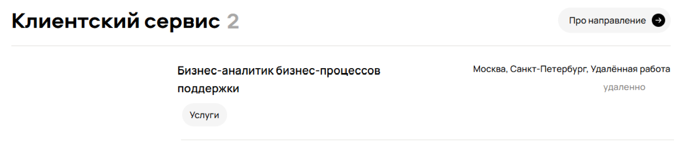
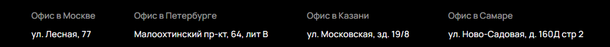
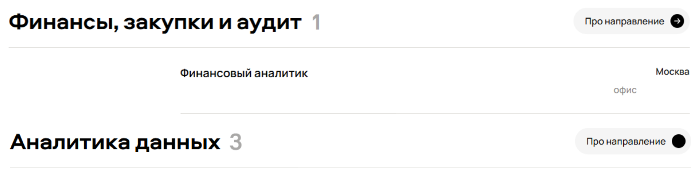
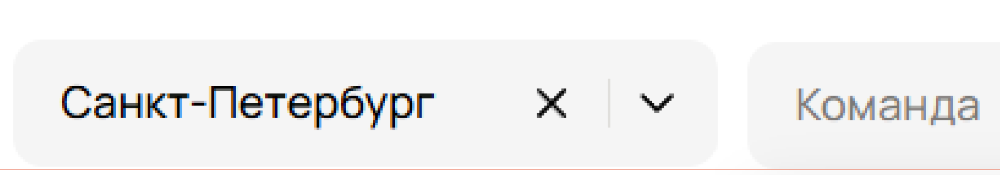
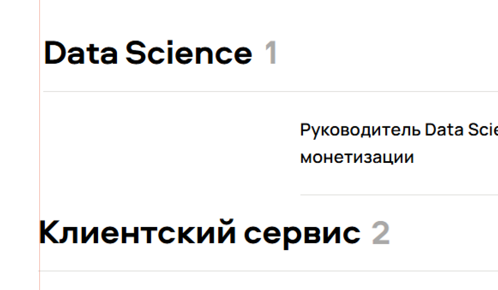
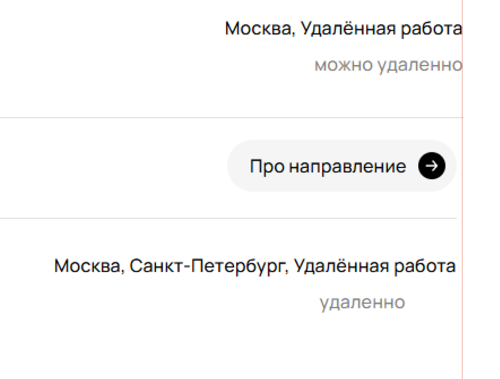
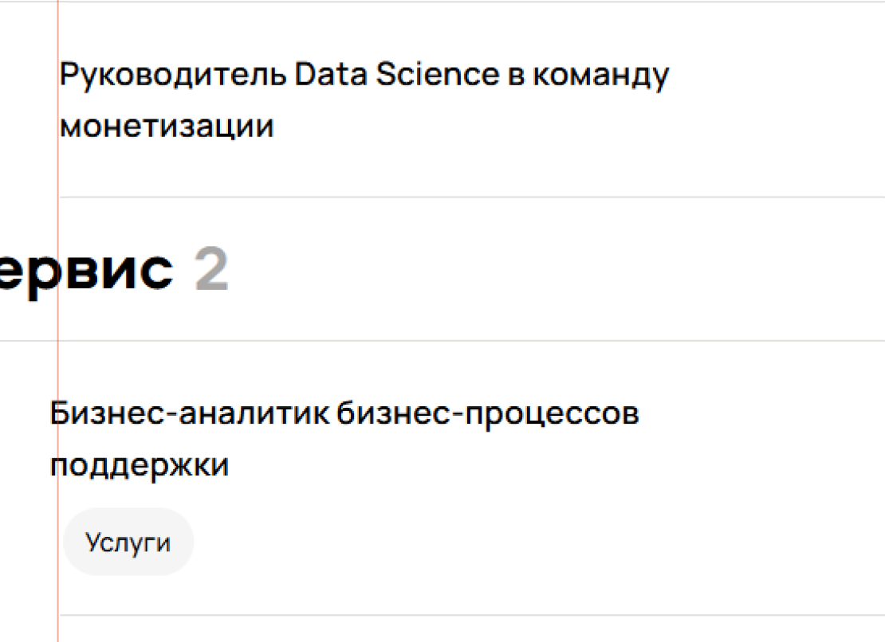
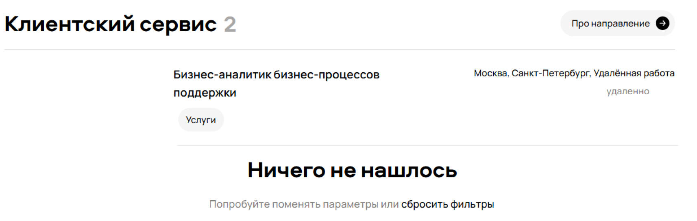
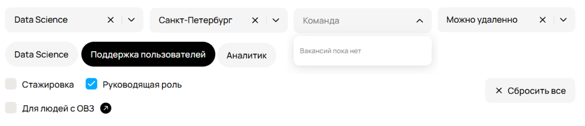

## Список найденных багов

---
**ID:** 1
**Заголовок:** Фильтр «Формат работы» работает некорректно  
**Описание:** При выборе формата «Можно удаленно» отображаются вакансии других форматов.  
**Шаги воспроизведения:**
1. Перейти на сайт [career.avito.com](https://career.avito.com/)
2. Выбрать раздел «Вакансии»
3. Ввести в поисковую строку «Аналитик»
4. Выбрать направление «Data Science»
5. Выбрать чекбокс «Руководящая должность»   
6. Выбрать город «Санкт-Петербург»
7. Выбрать фильтр «Формат работы → Удалённо»

**Фактический результат:** Появляются вакансии «офис», «офис и удалённо».  
**Ожидаемый результат:** Отображаются только вакансии формата «Удалённо».  
**Приоритет:** High  
**Почему:** Неверно работает ключевой фильтр, пользователь не может выбрать правильный формат.  
**Серьезность:** Major  
**Окружение:** ОС: Windows 10, браузер: Google Chrome 90, версия сайта: 1.2.3  
**Дата создания:** 23.11.2025
---

**ID:** 2  
**Заголовок:** Некорректная работа фильтра «Город»  
**Описание:** При выборе города «Санкт-Петербург» выводятся вакансии из других городов.  
**Шаги воспроизведения:**
1. Перейти на сайт [career.avito.com](https://career.avito.com/)
2. Выбрать раздел «Вакансии»
3. Ввести в поисковую строку «Аналитик»
4. Выбрать направление «Data Science»
5. Выбрать чекбокс «Руководящая должность»
6. Выбрать город «Санкт-Петербург»
7. Выбрать фильтр «Формат работы → Удалённо»

**Фактический результат:** Появляются вакансии из других городов.  
**Ожидаемый результат:** Должны выводиться только вакансии выбранного города.  
**Приоритет:** High  
**Почему:** Фильтр по городу является одним из ключевых параметров выбора вакансии 
**Серьезность:** Major  
**Окружение:** ОС: Windows 10, браузер: Google Chrome 90  
**Дата создания:** 23.11.2025
---

**ID:** 3  
**Заголовок:** Несоответствие количества вакансий с клиентским сервисом  
**Описание:** В клиентском сервисе найдено 1 вакансия, а на скриншоте отображается 2.  
**Шаги воспроизведения:**
1. Перейти на сайт [career.avito.com](https://career.avito.com/)
2. Выбрать раздел «Вакансии»
3. Ввести в поисковую строку «Аналитик»
4. Выбрать направление «Data Science»
5. Выбрать чекбокс «Руководящая должность»
6. Выбрать город «Санкт-Петербург»
7. Выбрать фильтр «Формат работы → Удалённо»

**Фактический результат:** Отображается 2 вакансии, хотя в клиентском сервисе только 1.  
**Ожидаемый результат:** Количество вакансий должно совпадать с клиентским сервисом.  
**Приоритет:** High  
**Почему:** Неправильное отображение количества вакансий вводит пользователя в заблуждение.  
**Серьезность:** Major  
**Окружение:** ОС: Windows 10, браузер: Google Chrome 90, версия сайта: 1.2.3  
**Дата создания:** 23.11.2025  
**Скриншот:**  

---

**ID:** 4  
**Заголовок:** Адрес вакансии Москвы указан неверно  
**Описание:** На скриншоте адрес указан как «ул. Лесная, 77» вместо корректного «ул. Лесная, 7».  
**Шаги воспроизведения:**
1. Перейти на сайт [career.avito.com](https://career.avito.com/)
2. Выбрать раздел «Вакансии»
3. Ввести в поисковую строку «Аналитик»
4. Выбрать направление «Data Science»
5. Выбрать чекбокс «Руководящая должность»
6. Выбрать город «Санкт-Петербург»
7. Выбрать фильтр «Формат работы → Удалённо»

**Фактический результат:** Адрес отображается как «ул. Лесная, 77».  
**Ожидаемый результат:** Должен быть «ул. Лесная, 7».  
**Приоритет:** Medium  
**Почему:** Неверный адрес вводит пользователя в заблуждение.  
**Серьезность:** Trivial  
**Окружение:** ОС: Windows 10, браузер: Google Chrome 90, версия сайта: 1.2.3  
**Дата создания:** 23.11.2025  
**Скриншот:**  

---

**ID:** 5  
**Заголовок:** Картинка крестика не загрузилась  
**Описание:** Кнопка очистки текста в поиске вакансии не отображается.  
**Шаги воспроизведения:**
1. Перейти на сайт [career.avito.com](https://career.avito.com/)
2. Выбрать раздел «Вакансии»
3. Ввести в поисковую строку «Аналитик»
4. Выбрать направление «Data Science»
5. Выбрать чекбокс «Руководящая должность»
6. Выбрать город «Санкт-Петербург»
7. Выбрать фильтр «Формат работы → Удалённо»

**Фактический результат:** Крестик отсутствует, отображается дефолтная картинка.  
**Ожидаемый результат:** Картинка крестика должна быть загружена и отображаться.  
**Приоритет:** Low  
**Почему:** Элемент управления закрытием должен быть видимым для пользователя.  
**Серьезность:** Minor  
**Окружение:** ОС: Windows 10, браузер: Google Chrome 90, версия сайта: 1.2.3  
**Дата создания:** 23.11.2025  
**Скриншот:**  

---

**ID:** 6  
**Заголовок:** Вакансии назначена неверная команда 
**Описание:** Вакансия "Руководитель аналитика по транзакционному направлению жилой недвижимости" помещена в команду «Авто».  
**Шаги воспроизведения:**
1. Перейти на сайт [career.avito.com](https://career.avito.com/)
2. Выбрать раздел «Вакансии»
3. Ввести в поисковую строку «Аналитик»
4. Выбрать направление «Data Science»
5. Выбрать чекбокс «Руководящая должность»
6. Выбрать город «Санкт-Петербург»
7. Выбрать фильтр «Формат работы → Удалённо»

**Фактический результат:** Вакансия находится в разделе «Авто».  
**Ожидаемый результат:** Должна быть в разделе «Недвижимость».  
**Приоритет:** High  
**Почему:** Некорректное распределение вакансий по командам.  
**Серьезность:** Major  
**Окружение:** ОС: Windows 10, браузер: Google Chrome 90, версия сайта: 1.2.3  
**Дата создания:** 23.11.2025
---

**ID:** 7  
**Заголовок:** Вакансии назначена неверная команда  
**Описание:** Вакансия "Бизнес-аналитик бизнес-процессов поддержки" помещена в команду «Услуги».  
**Шаги воспроизведения:**
1. Перейти на сайт [career.avito.com](https://career.avito.com/)
2. Выбрать раздел «Вакансии»
3. Ввести в поисковую строку «Аналитик»
4. Выбрать направление «Data Science»
5. Выбрать чекбокс «Руководящая должность»
6. Выбрать город «Санкт-Петербург»
7. Выбрать фильтр «Формат работы → Удалённо»

**Фактический результат:** Вакансия отображается в команде «Недвижимость».  
**Ожидаемый результат:** Должна быть в команде «Авто».  
**Приоритет:** High  
**Почему:** Некорректное распределение вакансий по командам.  
**Серьезность:** Major  
**Окружение:** ОС: Windows 10, браузер: Google Chrome 90, версия сайта: 1.2.3  
**Дата создания:** 23.11.2025
---

**ID:** 8  
**Заголовок:** Вакансии назначена неверная команда  
**Описание:** Вакансия "Бизнес-аналитик бизнес-процессов поддержки" помещен в команду «Услуги».  
**Шаги воспроизведения:**
1. Перейти на сайт [career.avito.com](https://career.avito.com/)
2. Выбрать раздел «Вакансии»
3. Ввести в поисковую строку «Аналитик»
4. Выбрать направление «Data Science»
5. Выбрать чекбокс «Руководящая должность»
6. Выбрать город «Санкт-Петербург»
7. Выбрать фильтр «Формат работы → Удалённо»

**Фактический результат:** Вакансия отображается в команде «Услуги».  
**Ожидаемый результат:** Вакансия должна быть в корректной команде.  
**Приоритет:** High  
**Почему:** Некорректное распределение вакансий по командам.  
**Серьезность:** Major  
**Окружение:** ОС: Windows 10, браузер: Google Chrome 90, версия сайта: 1.2.3  
**Дата создания:** 23.11.2025
---

**ID:** 9  
**Заголовок:** Вакансии назначена неверная команда  
**Описание:** Вакансия "Руководитель группы продаж по работе с агентствами" размещен в команду «Недвижимость».  
**Шаги воспроизведения:**
1. Перейти на сайт [career.avito.com](https://career.avito.com/)
2. Выбрать раздел «Вакансии»
3. Ввести в поисковую строку «Аналитик»
4. Выбрать направление «Data Science»
5. Выбрать чекбокс «Руководящая должность»
6. Выбрать город «Санкт-Петербург»
7. Выбрать фильтр «Формат работы → Удалённо»

**Фактический результат:** Вакансия отображается в команде «Недвижимость».  
**Ожидаемый результат:** Должна быть в корректной команде.  
**Приоритет:** High  
**Почему:** Некорректное распределение вакансий по командам.  
**Серьезность:** Major  
**Окружение:** ОС: Windows 10, браузер: Google Chrome 90, версия сайта: 1.2.3  
**Дата создания:** 23.11.2025
---

**ID:** 10  
**Заголовок:** В вакансии не отображается город  
**Описание:** Вакансия аналитика данных в бизнес-команду «Авито» не имеет указания города.  
**Шаги воспроизведения:**
1. Перейти на сайт [career.avito.com](https://career.avito.com/)
2. Выбрать раздел «Вакансии»
3. Ввести в поисковую строку «Аналитик»
4. Выбрать направление «Data Science»
5. Выбрать чекбокс «Руководящая должность»
6. Выбрать город «Санкт-Петербург»
7. Выбрать фильтр «Формат работы → Удалённо»

**Фактический результат:** Поле города пустое.  
**Ожидаемый результат:** Город должен быть указан.  
**Приоритет:** High  
**Почему:** Отсутствие города мешает поиску вакансий.  
**Серьезность:** Major  
**Окружение:** ОС: Windows 10, браузер: Google Chrome 90, версия сайта: 1.2.3  
**Дата создания:** 23.11.2025  
**Скриншот:**  

---

**ID:** 11  
**Заголовок:** Пропала стрелка у направления  
**Описание:** У направления "Аналитика данных" пропала стрелка вправо, у всех остальных она есть.  
**Шаги воспроизведения:**
1. Перейти на сайт [career.avito.com](https://career.avito.com/)
2. Выбрать раздел «Вакансии»
3. Ввести в поисковую строку «Аналитик»
4. Выбрать направление «Data Science»
5. Выбрать чекбокс «Руководящая должность»
6. Выбрать город «Санкт-Петербург»
7. Выбрать фильтр «Формат работы → Удалённо»

**Фактический результат:** Стрелка отсутствует.  
**Ожидаемый результат:** Стрелка должна отображаться у всех направлений.  
**Приоритет:** Medium  
**Почему:** Нарушено единообразие интерфейса.  
**Серьезность:** Minor  
**Окружение:** ОС: Windows 10, браузер: Google Chrome 90  
**Дата создания:** 23.11.2025  
**Скриншот:**  

---

**ID:** 12  
**Заголовок:** Нарушено выравнивание фильтра выбора команды  
**Описание:** Команда расположена чуть выше остальных элементов (приблизительно на 1 px), нарушено выравнивание.  
**Шаги воспроизведения:**
1. Перейти на сайт [career.avito.com](https://career.avito.com/)
2. Выбрать раздел «Вакансии»
3. Ввести в поисковую строку «Аналитик»
4. Выбрать направление «Data Science»
5. Выбрать чекбокс «Руководящая должность»
6. Выбрать город «Санкт-Петербург»
7. Выбрать фильтр «Формат работы → Удалённо»

**Фактический результат:** Команда визуально выше остальных элементов.  
**Ожидаемый результат:** Все элементы команды выровнены одинаково.  
**Приоритет:** High  
**Почему:** Нарушено визуальное восприятие интерфейса сайта.  
**Серьезность:** Minor  
**Окружение:** ОС: Windows 10, браузер: Google Chrome 90  
**Дата создания:** 23.11.2025  
**Скриншот:**  
  

---

**ID:** 13  
**Заголовок:** Нарушено выравнивание направлений и линии под ними  
**Описание:** Выравнивание направлений вакансий слева и справа нарушено.  
**Шаги воспроизведения:**
1. Перейти на сайт [career.avito.com](https://career.avito.com/)
2. Выбрать раздел «Вакансии»
3. Ввести в поисковую строку «Аналитик»
4. Выбрать направление «Data Science»
5. Выбрать чекбокс «Руководящая должность»
6. Выбрать город «Санкт-Петербург»
7. Выбрать фильтр «Формат работы → Удалённо»

**Фактический результат:** Нарушено визуальное оформление направлений и линии.  
**Ожидаемый результат:** Направления и линия выровнены корректно.  
**Приоритет:** Medium  
**Почему:** Нарушение интерфейса может сбивать пользователя.  
**Серьезность:** Minor  
**Окружение:** ОС: Windows 10, браузер: Google Chrome 90  
**Дата создания:** 23.11.2025  
**Скриншот:**  

---

**ID:** 14  
**Заголовок:** Формат работы не выровнен по правому краю  
**Описание:** Формат работы в вакансии должен быть выравнен по правому краю в списке вакансий, но нарушен.  
**Шаги воспроизведения:**
1. Перейти на сайт [career.avito.com](https://career.avito.com/)
2. Выбрать раздел «Вакансии»
3. Ввести в поисковую строку «Аналитик»
4. Выбрать направление «Data Science»
5. Выбрать чекбокс «Руководящая должность»
6. Выбрать город «Санкт-Петербург»
7. Выбрать фильтр «Формат работы → Удалённо»

**Фактический результат:** Формат работы смещен, правое выравнивание нарушено.  
**Ожидаемый результат:** Формат работы выровнен по правому краю.  
**Приоритет:** Medium  
**Почему:** Нарушение интерфейса.  
**Серьезность:** Minor  
**Окружение:** ОС: Windows 10, браузер: Google Chrome 90  
**Дата создания:** 23.11.2025  
**Скриншот:**  

---

**ID:** 15  
**Заголовок:** Курсор в поле для ввода обрезан  
**Описание:** Курсор отображается обрезанным в поле для ввода текста. 
**Шаги воспроизведения:**
1. Перейти на сайт [career.avito.com](https://career.avito.com/)
2. Выбрать раздел «Вакансии»
3. Ввести в поисковую строку «Аналитик»
4. Выбрать направление «Data Science»
5. Выбрать чекбокс «Руководящая должность»
6. Выбрать город «Санкт-Петербург»
7. Выбрать фильтр «Формат работы → Удалённо»

**Фактический результат:** Курсор не полностью виден.  
**Ожидаемый результат:** Курсор отображается полностью.  
**Приоритет:** Low  
**Почему:** Нарушение интерфейса мешает пользователю вводить текст.  
**Серьезность:** Minor  
**Окружение:** ОС: Windows 10, браузер: Google Chrome 90  
**Дата создания:** 23.11.2025  
**Скриншот:**  
**Фактический результат:**  
  
**Ожидаемый результат:**  

---

**ID:** 16  
**Заголовок:** Нарушено выравнивание ячейки вакансии  
**Описание:** Ячейка вакансии нарушает выравнивание слева и справа, а так же линия снизу вакансии так же нарушает выравнивание в списке вакансий.  
**Шаги воспроизведения:**
1. Перейти на сайт [career.avito.com](https://career.avito.com/)
2. Выбрать раздел «Вакансии»
3. Ввести в поисковую строку «Аналитик»
4. Выбрать направление «Data Science»
5. Выбрать чекбокс «Руководящая должность»
6. Выбрать город «Санкт-Петербург»
7. Выбрать фильтр «Формат работы → Удалённо»

**Фактический результат:** Вакансия смещена и нарушает визуальное оформление списка.  
**Ожидаемый результат:** Ячейка выровнена корректно.  
**Приоритет:** Medium  
**Почему:** Нарушение интерфейса.  
**Серьезность:** Minor  
**Окружение:** ОС: Windows 10, браузер: Google Chrome 90  
**Дата создания:** 23.11.2025  
**Скриншот:**  

---

**ID:** 17  
**Заголовок:** Ошибка в написании слова «Telegram»  
**Описание:** Вакансии отображаются с ошибкой: «Telagram» вместо «Telegram».  
**Шаги воспроизведения:**
1. Перейти на сайт [career.avito.com](https://career.avito.com/)
2. Выбрать раздел «Вакансии»
3. Ввести в поисковую строку «Аналитик»
4. Выбрать направление «Data Science»
5. Выбрать чекбокс «Руководящая должность»
6. Выбрать город «Санкт-Петербург»
7. Выбрать фильтр «Формат работы → Удалённо»

**Фактический результат:** Неправильное написание слова.  
**Ожидаемый результат:** Слово должно быть написано правильно — «Telegram».  
**Приоритет:** Low  
**Почему:** Нарушение интерфейса, снижает восприятие текста.  
**Серьезность:** Trivial  
**Окружение:** ОС: Windows 10, браузер: Google Chrome 90  
**Дата создания:** 23.11.2025  

---

**ID:** 18  
**Заголовок:** Выдаются не руководящие должности при выбранном фильтре  
**Описание:** Фильтр «руководящая должность» выбран, но выдаются вакансии без руководящей позиции.  
**Шаги воспроизведения:**
1. Перейти на сайт [career.avito.com](https://career.avito.com/)
2. Выбрать раздел «Вакансии»
3. Ввести в поисковую строку «Аналитик»
4. Выбрать направление «Data Science»
5. Выбрать чекбокс «Руководящая должность»
6. Выбрать город «Санкт-Петербург»
7. Выбрать фильтр «Формат работы → Удалённо»

**Фактический результат:** Появляются вакансии без руководящей должности.  
**Ожидаемый результат:** Должны выводиться только руководящие позиции.  
**Приоритет:** High  
**Почему:** Нарушение логики фильтрации.  
**Серьезность:** Major  
**Окружение:** ОС: Windows 10, браузер: Google Chrome 90  
**Дата создания:** 23.11.2025
---

**ID:** 19
**Заголовок:** Фильтр тегов показывает лишние значения  
**Описание:** При выборе направления «Data Science» фильтр тегов показывает также «Поддержка пользователей» и «Аналитик», хотя должен показывать только тег «Data Science».  
**Шаги воспроизведения:**
1. Перейти на сайт [career.avito.com](https://career.avito.com/)
2. Выбрать раздел «Вакансии»
3. Ввести в поисковую строку «Аналитик»
4. Выбрать направление «Data Science»
5. Выбрать чекбокс «Руководящая должность»
6. Выбрать город «Санкт-Петербург»
7. Выбрать фильтр «Формат работы → Удалённо»

**Фактический результат:** Появляются дополнительные теги, не относящиеся к «Data Science».  
**Ожидаемый результат:** Должен отображаться только тег «Data Science».  
**Приоритет:** Medium  
**Почему:** Нарушение логики фильтрации.  
**Серьезность:** Minor  
**Окружение:** ОС: Windows 10, браузер: Google Chrome 90  
**Дата создания:** 23.11.2025
---

**ID:** 20  
**Заголовок:** Сообщение «Вакансий пока нет» при наличии вакансий в фильтре команды  
**Описание:** В фильтре команды невозможно выбрать вакансию, хотя вакансии реально найдены — система показывает «Вакансий пока нет».  
**Шаги воспроизведения:**
1. Перейти на сайт [career.avito.com](https://career.avito.com/)
2. Выбрать раздел «Вакансии»
3. Ввести в поисковую строку «Аналитик»
4. Выбрать направление «Data Science»
5. Выбрать чекбокс «Руководящая должность»
6. Выбрать город «Санкт-Петербург»
7. Выбрать фильтр «Формат работы → Удалённо»

**Фактический результат:** Отображается сообщение «Вакансий пока нет», хотя вакансии существуют.  
**Ожидаемый результат:** Сообщение «Вакансий пока нет» должно появляться только если реально нет доступных вакансий для выбранного фильтра.

**Приоритет:** High  
**Почему:** Нарушение логики фильтрации, пользователь не может выбрать доступную вакансию.  
**Серьезность:** Major  
**Окружение:** ОС: Windows 10, браузер: Google Chrome 90  
**Дата создания:** 23.11.2025

**Комментарии:**
- Возможный сценарий 1: Вакансии реально существуют → сообщение «Вакансий пока нет» является багом.
- Возможный сценарий 2: При выбранных фильтрах ни одна вакансия не подходит → сообщение «Вакансий пока нет» корректно.
---

**ID:** 21  
**Заголовок:** Некорректное отображение вакансий в клиентском сервисе  
**Описание:** В направлении «Клиентский сервис» выводится сообщение «Ничего не найдено», хотя реально есть 1 вакансия.  
**Шаги воспроизведения:**
1. Перейти на сайт [career.avito.com](https://career.avito.com/)
2. Выбрать раздел «Вакансии»
3. Ввести в поисковую строку «Аналитик»
4. Выбрать направление «Data Science»
5. Выбрать чекбокс «Руководящая должность»
6. Выбрать город «Санкт-Петербург»
7. Выбрать фильтр «Формат работы → Удалённо»

**Фактический результат:** Появляется сообщение «Ничего не найдено», несмотря на наличие вакансии.  
**Ожидаемый результат:** Если вакансия реально существует, сообщение «Ничего не найдено» не должно отображаться.

**Приоритет:** High  
**Почему:** Нарушение логики фильтрации, пользователь может не найти существующую вакансию.  
**Серьезность:** Major  
**Окружение:** ОС: Windows 10, браузер: Google Chrome 90  
**Дата создания:** 23.11.2025  
**Скриншот:**  

**Комментарии:**
- Возможный сценарий 1: Вакансия реально существует → сообщение «Ничего не найдено» является багом.
- Возможный сценарий 2: В выбранных фильтрах ни одна вакансия не подходит → «Ничего не найдено» корректно, а все другие вакансии, которые появились, показаны ошибочно → баг с неверной выдачей вакансий.
---

**ID:** 22  
**Заголовок:** Крестик кнопки «Сбросить все» слева, нарушен единый стиль  
**Описание:** Крестик находится слева, хотя у остальных кнопок он справа.  
**Шаги воспроизведения:**
1. Перейти на сайт [career.avito.com](https://career.avito.com/)
2. Выбрать раздел «Вакансии»
3. Ввести в поисковую строку «Аналитик»
4. Выбрать направление «Data Science»
5. Выбрать чекбокс «Руководящая должность»
6. Выбрать город «Санкт-Петербург»
7. Выбрать фильтр «Формат работы → Удалённо»
8. Обратить внимание на расположение крестика кнопки «Сбросить все»

**Фактический результат:** Крестик слева, текст кнопки справа.  
**Ожидаемый результат:** Крестик должен быть расположен одинаково с другими кнопками. Должен сохранятся единый стиль структуры кнопок.  
**Приоритет:** Low  
**Почему:** Нарушен единый визуальный стиль интерфейса.  
**Серьезность:** Minor  
**Окружение:** ОС: Windows 10, браузер: Google Chrome 90  
**Дата создания:** 23.11.2025  
**Скриншот:**  
  

**Комментарии:**
- Это скорее визуальный нюанс, но может нарушать восприятие интерфейса пользователем.
- Я бы уточнил, является ли это особенностью дизайна или все таки багом.  ъ
---

**ID:** 23  
**Заголовок:** Вывод вакансий, когда ни одна не подходит под выбранные фильтры  
**Описание:** При выборе фильтров, по которым **не существует подходящих вакансий**, сайт некорректно выводит вакансии.  
**Шаги воспроизведения:**
1. Перейти на сайт [career.avito.com](https://career.avito.com/)
2. Выбрать раздел «Вакансии»
3. Ввести в поисковую строку «Аналитик»
4. Выбрать направление «Data Science»
5. Выбрать чекбокс «Руководящая должность»
6. Выбрать город «Санкт-Петербург»
7. Выбрать фильтр «Формат работы → Удалённо»

**Фактический результат:** Система выводит вакансии, хотя ни одна не соответствует выбранным фильтрам.  
**Ожидаемый результат:** Должно отображаться сообщение **«Вакансий пока нет»**, так как нет подходящих вакансий.
**Приоритет:** High  
**Почему:** Пользователь может видеть некорректные вакансии, что вводит в заблуждение и нарушает фильтрацию.  
**Серьезность:** Major  
**Окружение:** ОС: Windows 10, браузер: Google Chrome 90  
**Дата создания:** 23.11.2025

